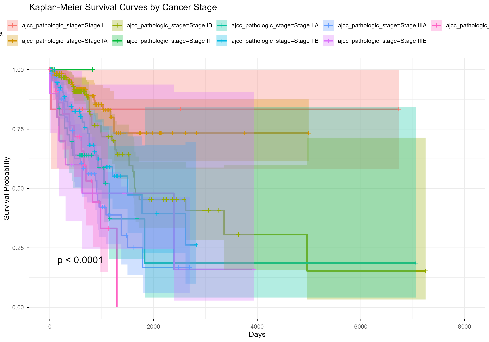
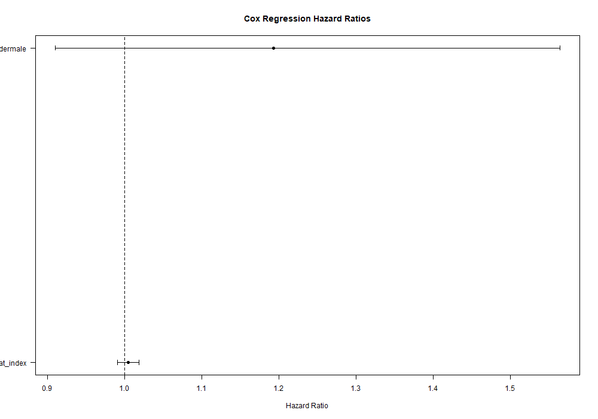
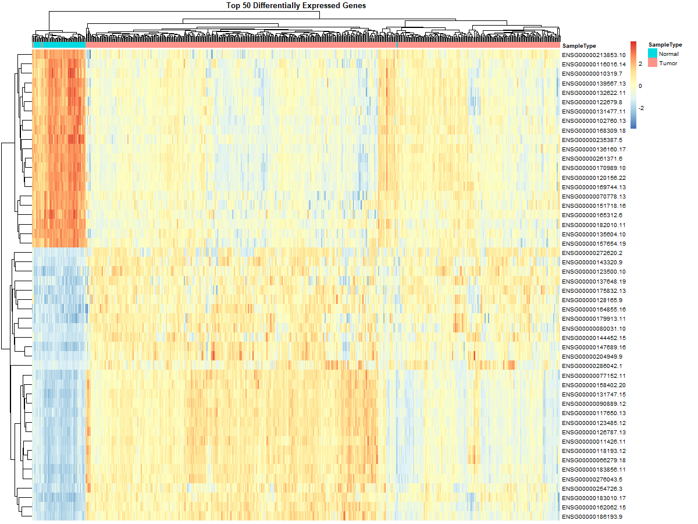
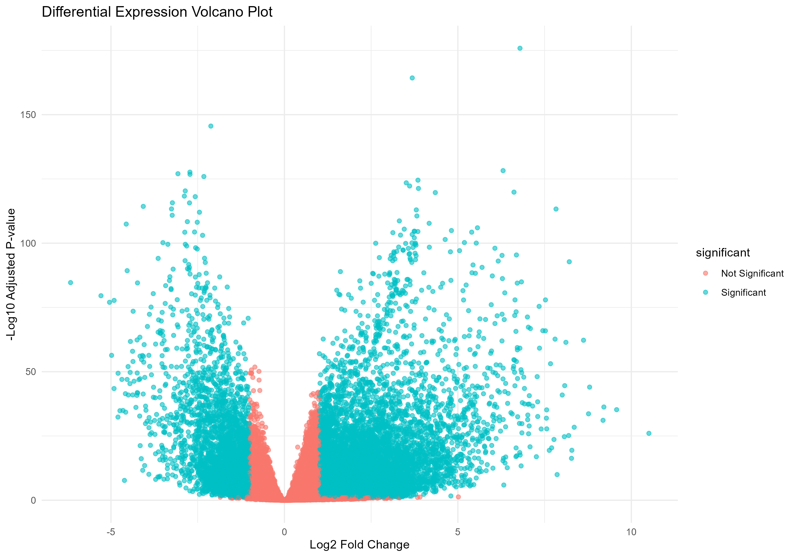
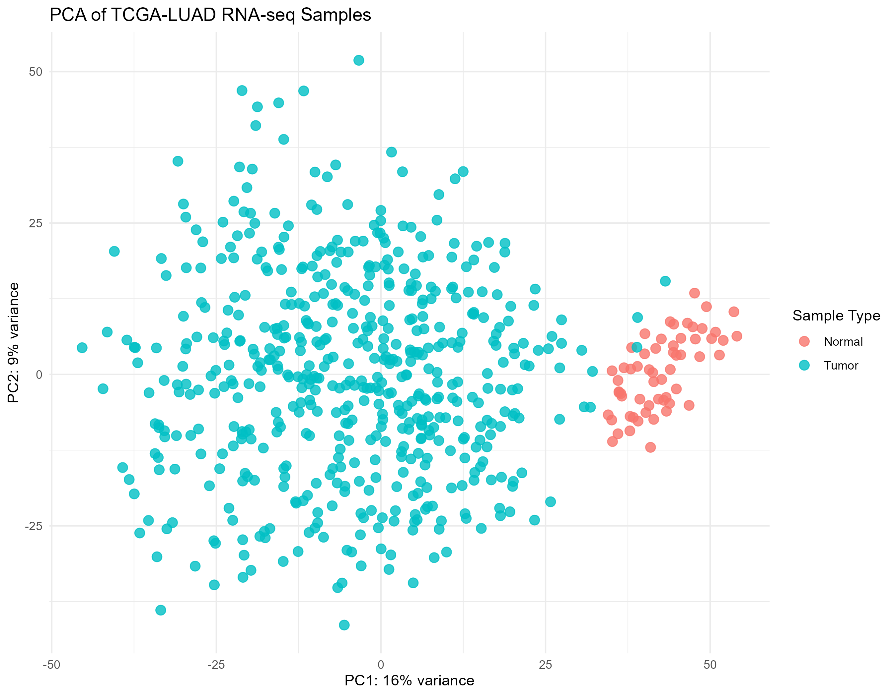
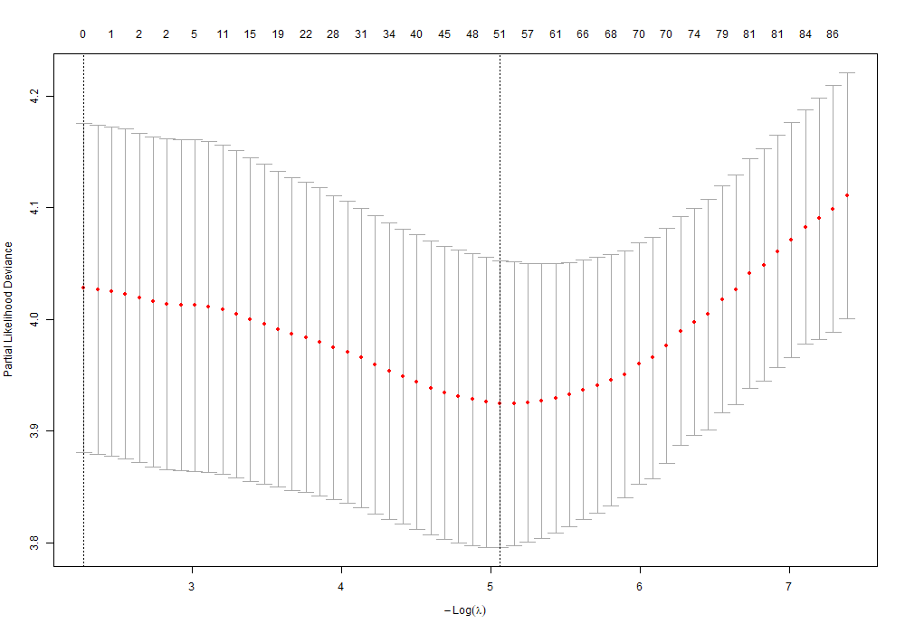

# AWS Cancer Survival Pipeline

Cloud-native bioinformatics pipeline for lung cancer survival analysis using TCGA-LUAD clinical and RNA-seq data.

The project combines statistical survival modelling, differential expression analysis, reproducible R workflows, Docker, Nextflow, AWS-oriented pipeline design, and an interactive Shiny dashboard.

## Overview

This repository demonstrates an end-to-end cancer bioinformatics workflow:

- TCGA-LUAD data download and preprocessing
- clinical metadata cleaning
- RNA-seq exploratory analysis
- differential expression analysis
- Kaplan-Meier survival analysis
- Cox proportional hazards modelling
- LASSO Cox feature selection
- dimensionality reduction with PCA
- visualization of survival and expression results
- reproducible workflow orchestration with Nextflow
- containerized execution with Docker
- interactive dashboard prototype with Shiny

---
## Results Preview

Key outputs generated by the pipeline:

### Kaplan-Meier Survival Curve



### Cox Model Hazard Ratios



### Cox Forest Plot



### Differential Expression Volcano Plot



### PCA of RNA-seq Samples



### Top Differentially Expressed Genes


### LASSO Cox Model Cross-Validation



---

## Tech Stack

- R
- Bioconductor
- DESeq2
- survival / survminer
- glmnet
- ggplot2
- pheatmap
- Shiny
- Nextflow
- Docker
- AWS S3 / EC2 / Batch-ready structure
- GitHub Actions

## Repository Structure

```text
.
├── analysis/              # R Markdown analysis reports
├── dashboard/             # Shiny dashboard
├── docker/                # Docker environment
├── nextflow/              # Nextflow workflow files
├── results/               # Figures and output tables
├── scripts/               # Reusable R scripts
├── GDCdata/               # TCGA downloaded data
├── .github/workflows/     # CI configuration
├── gdc_manifest.txt       # GDC data manifest
├── MANIFEST.txt           # Project manifest
└── README.md
